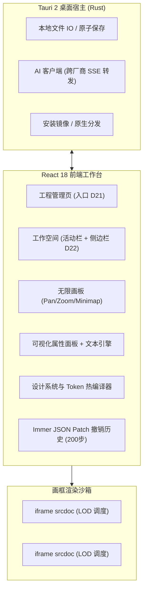

# AI Designer Studio

<p align="center">
  
</p>

<p align="center">
  <strong>面向下一代产品经理、UI/UX 设计师与全栈工程师的 AI 原生（AI-First）智能设计工具</strong>
</p>

<p align="center">
  
  
  
  
  
</p>

---

## 📖 产品概述

**AI Designer Studio** 是一款**单机原生、高度可控、开箱即用**的现代 UI/UX 设计协作与生成工具。

不同于市面上仅生成单一静态代码预览或难以精确微调的纯对话工具，AI Designer Studio 融合了 **Figma 级别的无限多画框画板** 与 **AI 原生生成能力**，引入 **Design Token 强约束基座**、**精准 DOM 元素级点选检查器**、**组件复用与自动冲突隔离** 以及 **并排式 AI 方案采纳体系**。用户只需自然语言输入需求，即可秒级生成多页面原型，随时可视化精修，并导出高品质干净可运行的 Web 原型。

---

## ✨ 核心特性

### 1. 🎨 无限多页面设计画板 (Infinite Canvas)
- **多页面总览**：支持在同一画板中自由缩放（10%–400%）、空格拖拽平移、迷你导航地图 (Minimap)、快速复位与自适应视野（Fit All）。
- **设备档位固定约束 (D8)**：工程级统一定义 PC 桌面端 (1440px) 或移动端 (390px)，保证响应式断点与布局语义严谨。
- **内容自适应撑开 + 首屏视口线 (D13)**：画框高度由 HTML 内容天然撑开，叠加虚线标出设备首屏折线（PC 900px / 移动端 844px），兼顾宏观长图总览与真实视口感知。
- **顶栏独立拖动与整理排列**：按住画框标题栏即可自由摆放，内置无重叠一键「整理排列 (Auto-Arrange)」。

### 2. 💬 对话式 AI 助手与意图分发
- **多厂商网关接入**：内置 OpenAI、Anthropic Claude、Google Gemini、DeepSeek 预设，并支持任意 OpenAI 兼容自定义 Base URL（Ollama / vLLM / LocalAI）。
- **四大能力档位绑定 (Model Roles)**：按职责分别绑定代码生成档、对话推理档、视觉理解档与生图档。
- **显式上下文提及 (`@` 实体)**：对话中通过 `@页面名`、`@组件名` 精确注入上下文，杜绝幻觉猜测。
- **AI 变更并排采纳 (D17)**：整页重写不直接覆盖原画框，并排呈现新旧对比，提供 **「采纳新版 (自动备份 Checkpoint)」**、**「两版都留」** 与 **「保留原版」** 三分支。

### 3. 🎯 元素级检查器与微调 (Point & Edit)
- **精确点选与盒模型标尺**：画框直接监听原生 DOM 事件（无需额外通信跨域桥），显示悬浮虚线、选中高亮框与 Margin/Padding 标尺。
- **安全文本编辑引擎 (ISSUE-001~004 彻底收敛)**：
  - 双击行内编辑与属性面板受控联动；
  - 自动识别并保护嵌套子元素结构，防止容器内容被意外抹平；
  - 基于 DOMParser 原生解析，杜绝正则替换造成的非法标签损坏。
- **L4 覆盖层分离**：所有可视化修改写入独立的样式覆盖层（`overrides`），绝不破坏底层基础 HTML。

### 4. 🧩 组件复用与批量同步 (Components)
- **重复子树结构指纹探测**：自动识别工程内重复出现 ≥3 次的元素并提示提取为公用组件。
- **内联 + 反向索引模型 (D6)**：各页面保留内联 DOM，兼具可读性与独立渲染能力。
- **批量同步与冲突跳过 (D12)**：编辑组件定义可一键全量更新所有实例，若某实例存在手动样式覆盖则自动跳过并列出明细，保护用户定制结果。

### 5. 💎 统一设计系统 (Design Tokens) & Token Lint
- **一键主题推导**：基于主色自动生成 50–900 完整色彩梯度阶梯，支持 Light / Dark 双模式映射。
- **全画框秒级热更新**：修改 Token 仅热重编译 CSS 变量，无需重绘 HTML 或重发 AI 请求。
- **Token Lint 严苛闸门**：全量扫描硬编码字面量色值（`#hex`/`rgb`）、非规范圆角及间距，支持一键批量映射修复为 Token CSS 变量。
- **基座样式表只读查看与 AI 演进 (D15)**：内置标准 Utility 类库，支持通过对话生成基座扩展并审查类级 Diff。

### 6. 🧠 工程记忆与设计决策沉淀 (D18 / D20)
- 对话中产生的全局性约束（如 *"本工程一律不使用渐变"*）自动捕获为工程级候选决策。
- 用户确认后沉淀为工程资产，自动注入后续 AI System Prompt。
- 决策支持停用（保留历史痕迹）而非直接删除。

### 7. 📦 纯净单页自包含交付 (D5 / D14 / D19)
- **单页自包含 HTML**：双击即可在任何现代浏览器中打开，内联编译后的基座 CSS、L4 覆盖层与当前模式的 Token 变量，**100% 剥离内部 `data-nid` / `data-asset-id` 等开发契约属性**。
- **高清 PNG 导出**：支持 1x / 2x / 3x 超分辨率，可选完整高度长图或首屏截断。

---

## 🏗️ 架构与关键技术决策



- **D1 桌面形态**：选用 Tauri 2 架构，免除浏览器跨域限制，安装包体积仅 ~3.5MB（比传统 Electron 缩减 95%）。
- **D10 文档模型契约**：基于稳定 `data-nid` 追踪元素，解耦结构层与视觉覆盖层。
- **D16 扁平 Store**：状态按 ID 扁平寻址，杜绝数组索引错位对撤销栈（JSON Patch）造成的历史失效。

---

## 📂 项目结构

```text
designer/
├── src/
│   ├── components/
│   │   ├── assets/           # 资源中心面板 (图片、图标、组件、字体)
│   │   ├── canvas/           # 无限画板、画框容器 (ScreenFrame)、Minimap
│   │   ├── chat/             # AI 对话助手、流式输出、Prompt 模板
│   │   ├── export/           # 交付导出面板 (自包含 HTML / 高清 PNG)
│   │   ├── inspector/        # 检查器 (属性面板、样式覆盖、盒模型标尺)
│   │   ├── layout/           # 顶栏、活动栏、侧边栏折叠面板 (Accordion)
│   │   ├── settings/         # AI Provider 设置与能力档位配置
│   │   ├── theme/            # 主题设计系统可视化调节器
│   │   └── workspace/        # 工程管理启动页 (ProjectManager)
│   ├── services/ai/          # AI 服务封装、Prompt 组装器 (PromptBuilder)
│   ├── stores/               # Zustand 全局 Store (useProjectStore, useHistoryStore 等)
│   ├── styles/               # Token 基座样式 (base.css)
│   ├── types/                # 数据模型类型契约 (PRD §4)
│   └── utils/                # 核心引擎: nidEngine, textNode, cssCompiler, tokenLint...
├── src-tauri/                # Tauri 2 原生桌面工程 (Cargo.toml, tauri.conf.json)
├── test/                     # 自动化测试集 (PRD 验收、组件回归、文本安全)
├── scripts/                  # 桌面打包脚本 (package-desktop.sh)
├── dist-desktop/             # 桌面分发包输出目录 (.app, .dmg, .zip)
└── doc/                      # 架构规范、PRD、分期计划、缺陷记录
    ├── prd.md                # 完整产品需求文档 (PRD v1.1.0)
    ├── plan-product.md       # 产品研发全阶段交付计划 (Phase 0~3)
    ├── aesthetic.md          # 美学升级专项工程规范与计划 (A0~A3)
    └── issues.md             # 关键缺陷排查与修复记录
```

---

## 🚀 快速上手

### 环境准备
- [Bun](https://bun.sh/) (推荐) 或 Node.js ≥ 18
- [Rust](https://www.rust-lang.org/) (用于 Tauri 桌面端构建)
- macOS / Windows / Linux 开发环境

### 1. 安装依赖
```bash
bun install
```

### 2. 启动 Web 调试环境
```bash
bun run dev
```
启动后在浏览器访问 `http://localhost:5173/`。首次进入会自动呈现「工程管理页」，您可以一键新建或载入示例工程。

### 3. 运行自动化测试与类型检查
工程内建了严格的质量防线与 PRD 验收套件：
```bash
# 执行全部 74 个自动化单元测试与综合验收用例
bun test

# TypeScript 类型安全校验
bun run type-check

# 前端生产打包构建
bun run build
```

---

## 🖥️ 桌面端构建与分发 (Tauri 2)

### 桌面端开发预览
```bash
bunx tauri dev
```

### 桌面端一键编译与打包
```bash
# 方式 A：一键打包完整 macOS 分发产物 (.app + .dmg + .zip)
bun run package:desktop

# 方式 B：仅生成原生 .app 应用程序
bun run tauri:build
```

编译完成后，分发包将输出在 [`dist-desktop/`](./dist-desktop) 目录下：
- **`AI Designer Studio.app`** (~8.4 MB)：macOS 原生应用程序。
- **`AI-Designer-Studio-1.0.0-macos.dmg`** (~3.5 MB)：包含应用拖拽快捷安装的标准磁盘镜像。
- **`AI-Designer-Studio-1.0.0-macos.zip`** (~3.1 MB)：即开即用的便携式压缩分发包。

运行桌面程序：
```bash
open "dist-desktop/AI Designer Studio.app"
```

---

## 🧪 自动化测试套件说明

| 测试文件 | 用例数 | 覆盖核心内容 |
| :--- | :---: | :--- |
| [`test/prd_acceptance.test.tsx`](./test/prd_acceptance.test.tsx) | 20 | PRD D1–D22 决策验证、单页 HTML 剥离导出、AI 并排采纳三分支、组件冲突跳过、工程记忆 |
| [`test/acceptance.test.tsx`](./test/acceptance.test.tsx) | 17 | M1 工程管理、档位创建后只读、画框顶栏拖动位移换算、折叠面板记忆持久化 |
| [`test/textNode.test.ts`](./test/textNode.test.ts) | 17 | ISSUE-001~004 回归验证、直接子文本保护、void 元素置灰、DOM 安全写回 |
| [`test/projectRegistry.test.ts`](./test/projectRegistry.test.ts) | 11 | 多工程注册表隔离、元数据读取、损坏容错降级、旧版单工程存档平滑迁移 |
| [`test/studio_full.test.ts`](./test/studio_full.test.ts) | 8 | NidEngine 稳定哈希、TokenLint 扫描与自动修复、PromptBuilder 上下文拼装 |
| [`test/phase3.test.ts`](./test/phase3.test.ts) | 1 | DOMParser 环境下的组件结构指纹提取与重复子树探测 |

---

## 📄 许可证

本项目遵循 [MIT License](./LICENSE) 协议。
